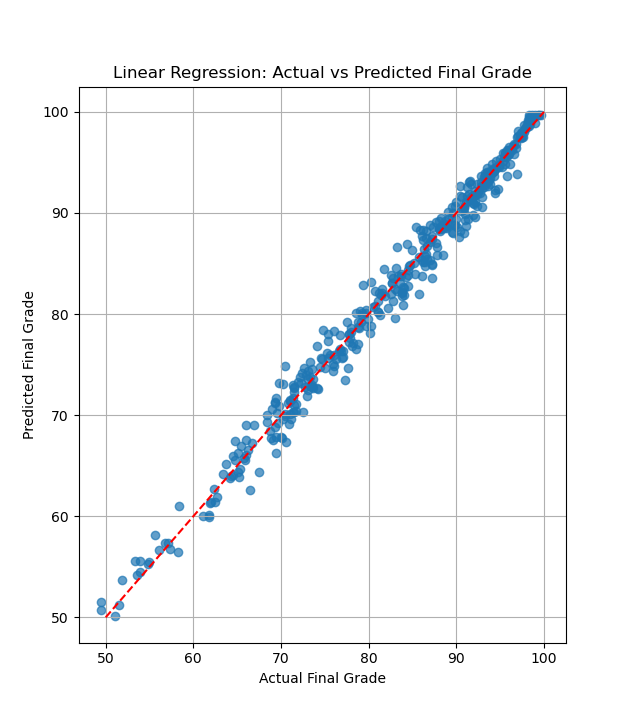

# CCSICT Digital Grading System

- [CCSICT Digital Grading System](#ccsict-digital-grading-system)
  - [**Simple Description**](#simple-description)
  - [**Concept**](#concept)
  - [**Dataset Contents (Columns)**](#dataset-contents-columns)
  - [How accurate it is?](#how-accurate-it-is)
  - [Example implementation](#example-implementation)
  - [authors. aka Coffee drinker](#authors-aka-coffee-drinker)
  - [Special thanks to](#special-thanks-to)

## **Simple Description**

A small system that stores student records using SQLite and performs basic CRUD operations. The dataset includes grades, study habits, attendance, and exam scores. **A linear regression model** is then trained to predict student grades from input data. Also It can be used to visualize suffs on it using matplotlib.

## **Concept**

The system designed to handle a student database where you can Create, Read, Update, and Delete records. Each record contains both academic and behavioral numeric fields, so the dataset actually has enough structure to be used for simple data science tasks.

Once the database is filled, a linear regression model is used to predict the student’s GPA using variables such as:

- study_hours
- attendance_rate
- quiz_score
- midterm_score
- final_score

The model learns the relationship between how much a student studies, how often they show up, how they perform in quizzes/exams, and the resulting GPA.

## **Dataset Contents (Columns)**

These are the fields you stored in SQLite:

- id
- student_id
- program (BSCS, BSDSA, BSIT, BLIS, etc...)
- grade
- status (Passed/Failed)
- age
- study_hours
- attendance_rate
- quiz_score
- midterm_score
- final_score
- gpa

Plenty of numeric variables to feed into a regression model, plenty of students to analyze, and plenty of “data science” noise to make teacher happy.

## How accurate it is?

Linear regression graph shows:



with $R^2 \approx 0.9868$ saying this model can predict student grades with 98% accuracy.

## Example implementation

```bash
# predicting a Student who doesn't have performance tasks but perfect on everything else

Enter student info to predict final grade:
Attendance rate (0-100): 100
Quiz score (0-100): 100
Midterm score (0-100): 100
Performance task score (0-100): 0
Activities score (0-50): 50

Predicted final grade: 49.88489
Predicted status: FAIL
```

## authors. aka Coffee drinker

- AlieeLinux
  - 
- Intelsdesu(not part of this system. just his code exist on this repo)
  - 

> If this project doesn’t pass, the course is the problem, not the code.


## Special thanks to

- **[Isabela State University](https://isu.edu.ph/)**
  - who's the only reason why this system exists on the worst way possible.
- **Mrs G Echague branch.**
  - For giving the most amazing coffees and providing reliable wifi and other services
- **All of my classmates.**
  - Without them I would never reach 2nd year
- **Our professor**
  - Best professor in isu right now.
- **Van/bus Drivers**
  - Reason I can still go home.
